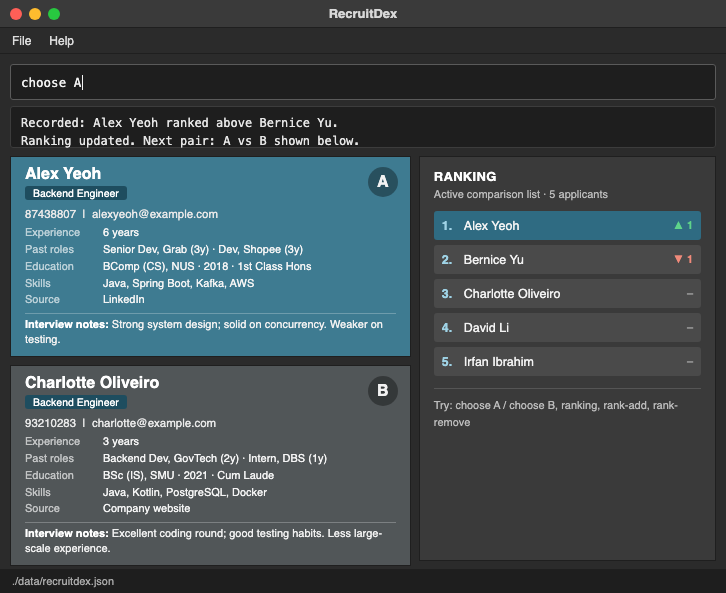
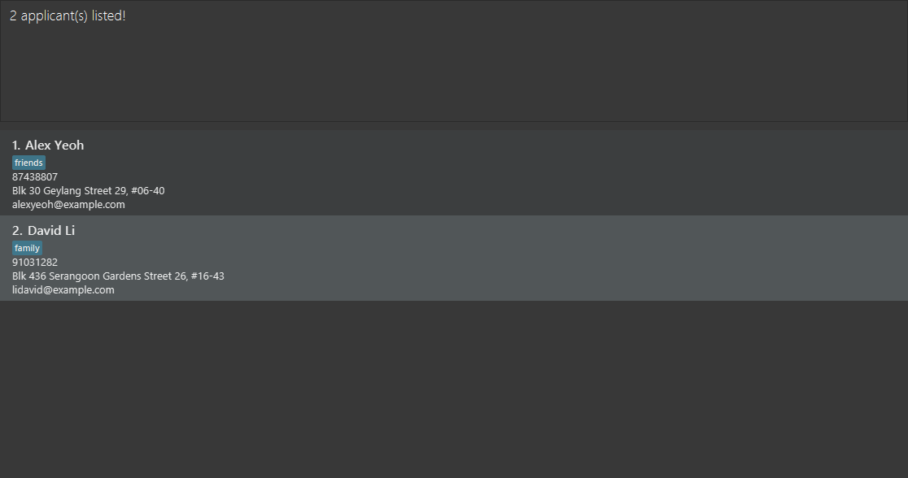

# AB-3 User Guide

AddressBook Level 3 (AB3) is a **desktop application for managing contacts, optimized for use through a Command Line Interface (CLI)** while retaining the benefits of a Graphical User Interface (GUI). If you type quickly, AB3 can help you manage contacts faster than traditional GUI applications.

<!-- * Table of Contents -->
<page-nav-print />

--------------------------------------------------------------------------------------------------------------------

## Quick start

1. Ensure that Java `25` or later is installed on your computer. 
   **Mac users:** Ensure you have the precise JDK version prescribed [here](https://se-education.org/guides/tutorials/javaInstallationMac.html).

1. Download the latest `.jar` file from [here](https://github.com/se-edu/addressbook-level3/releases).

1. Copy the file to the folder you want to use as the _home folder_ for your AddressBook.

1. Open a terminal, `cd` to the folder containing the JAR file, and run `java -jar addressbook.jar`. 
   A GUI similar to the one below should appear in a few seconds. Note how the app contains some sample data. 
   

1. Type a command in the command box and press Enter to execute it. For example, type **`help`** and press Enter to open the help window. 
   Some example commands you can try:

   * `list` : Lists all contacts.

   * `add n/John Doe p/98765432 e/johnd@example.com a/John street, block 123, #01-01` : Adds a contact named `John Doe` to the Address Book.

   * `delete 3` : Deletes the 3rd contact shown in the current list.

   * `clear` : Deletes all contacts.

   * `exit` : Exits the app.

1. Refer to the [Features](#features) section below for details of each command.

--------------------------------------------------------------------------------------------------------------------

## Features

<box type="info" seamless>

**Notes about the command format:** 

* Words in `UPPER_CASE` are the parameters to be supplied by the user. 
  For example, in `add n/NAME`, replace `NAME` with a value such as `John Doe`.

* Items in square brackets are optional. 
  For example, `n/NAME [t/TAG]` can be used as `n/John Doe t/friend` or as `n/John Doe`.

* Items followed by `...` can appear zero or more times. 
  For example, `[t/TAG]... ` may be omitted, or written as `t/friend` or `t/friend t/family`.

* Parameters can be in any order. 
  For example, if the command specifies `n/NAME p/PHONE_NUMBER`, `p/PHONE_NUMBER n/NAME` is also acceptable.

* Extraneous parameters for commands that take no parameters, such as `help`, `list`, `exit`, and `clear`, are ignored. 
  For example, `help 123` is interpreted as `help`.

* If you are using a PDF version of this document, be careful when copying and pasting commands that span multiple lines as space characters surrounding line-breaks may be omitted when copied over to the application.
</box>

### Viewing help: `help`

Shows a message explaining how to access the help page.

Format: `help`

### Adding an applicant: `add`

Adds an applicant to the address book.

Format: `add n/NAME p/PHONE_NUMBER e/EMAIL a/ADDRESS [i/INTERVIEW_NOTES] [y/YEARS_OF_EXPERIENCE] [s/SOURCE] [t/SKILL]... `

* `INTERVIEW_NOTES` is free text, for example `Strong system design`.
* `YEARS_OF_EXPERIENCE` is a whole number from 0 to 60.
* `SOURCE` is free text saying where the applicant came from, for example `LinkedIn` or `Referral`.
* `SKILL` is entered with the `t/` prefix. An applicant can have any number of skills, including zero. A skill can contain only letters and numbers, so `C++` is not accepted.
* The optional fields can be left out, or given with nothing after the prefix (for example `i/`), which leaves them empty.

Examples:
* `add n/John Doe p/98765432 e/johnd@example.com a/John street, block 123, #01-01`
* `add n/Betsy Crowe t/friend e/betsycrowe@example.com a/Newgate Prison p/1234567 t/criminal`
* `add n/Jane Doe p/91234567 e/jane@example.com a/Blk 1 Clementi y/6 s/LinkedIn i/Great system design t/Java t/Kafka`

### Adding an applicant to the comparison list: `compare-add`

Adds an existing applicant to the active comparison list.

Format: `compare-add INDEX`

* `INDEX` is a positive integer referring to the applicant's position in the displayed applicant list.
* After `find`, the index refers to the filtered results.
* The applicant must already have a record and must not already be in the comparison list.
* This command keeps applicant records and the current search filter unchanged.

Examples:

* `list` followed by `compare-add 2` selects the second applicant in the displayed list.
* `find Betsy` followed by `compare-add 1` selects the first applicant in the search results.

Comparison-list membership is not available in the current application.
Until this feature is enabled, a valid applicant selection reports
`The comparison list is not available yet.` and makes no changes.

### Removing an applicant from the comparison list: `compare-remove`

Removes an existing applicant from the active comparison list while keeping their record and comparison history.

Format: `compare-remove INDEX`

* `INDEX` is a positive integer referring to the applicant's position in the displayed applicant list.
* After `find`, the index refers to the filtered results.
* The current search filter is kept unchanged.
* Removing an applicant who is not in the comparison list reports
  `This applicant is not in the comparison list.` and makes no changes.
* Decisions involving the removed applicant are retained but excluded from the current ranking.
  Adding the applicant back makes those decisions eligible again when both participants are active.
* An unanswered comparison involving the removed applicant is cleared or replaced.

Examples:

* `list` followed by `compare-remove 2` selects the second applicant in the displayed list.
* `find Betsy` followed by `compare-remove 1` selects the first applicant in the search results.

Comparison-list membership is not available in the current application.
Until this feature is enabled, a valid applicant selection reports
`The comparison list is not available yet.` and makes no changes.

### Listing all applicants: `list`

Shows a list of all applicants in the address book.

Format: `list`

### Editing an applicant: `edit`

Edits an existing applicant in the address book.

Format: `edit INDEX [n/NAME] [p/PHONE] [e/EMAIL] [a/ADDRESS] [i/INTERVIEW_NOTES] [y/YEARS_OF_EXPERIENCE] [s/SOURCE] [t/SKILL]... `

* Edits the applicant at the specified `INDEX`. The index refers to the index number shown in the displayed applicant list. The index **must be a positive integer** 1, 2, 3, ...
* At least one of the optional fields must be provided.
* Existing values will be updated to the input values.
* When editing skills (`t/`), all of the applicant's existing skills are removed; adding skills is not cumulative.
* To remove all of an applicant's skills, enter `t/` without a skill after it.
* To clear the interview notes, years of experience or source, enter its prefix with nothing after it, for example `i/`.

Examples:
*  `edit 1 p/91234567 e/johndoe@example.com` Edits the phone number and email address of the 1st applicant to be `91234567` and `johndoe@example.com` respectively.
*  `edit 2 n/Betsy Crower t/` Edits the name of the 2nd applicant to be `Betsy Crower` and clears all existing skills.
*  `edit 1 y/7 s/Referral` Sets the years of experience of the 1st applicant to `7` and the source to `Referral`.
*  `edit 3 i/` Clears the interview notes of the 3rd applicant.

### Locating applicants by name: `find`

Finds applicants whose names contain any of the given keywords.

Format: `find KEYWORD [MORE_KEYWORDS]`

* The search is case-insensitive; for example, `hans` matches `Hans`.
* Keyword order does not matter; for example, `Hans Bo` matches `Bo Hans`.
* The search considers only names.
* Only full words match; for example, `Han` does not match `Hans`.
* Applicants matching at least one keyword are returned (an `OR` search); for example, `Hans Bo` returns `Hans Gruber` and `Bo Yang`.

Examples:
* `find John` returns `john` and `John Doe`
* `find alex david` returns `Alex Yeoh`, `David Li` 
  

### Deleting an applicant: `delete`

Deletes the specified applicant from the address book.

Format: `delete INDEX`

* Deletes the applicant at the specified `INDEX`.
* The index refers to the index number shown in the displayed applicant list.
* The index **must be a positive integer** 1, 2, 3, ...

Examples:
* `list` followed by `delete 2` deletes the 2nd applicant in the address book.
* `find Betsy` followed by `delete 1` deletes the 1st applicant in the results of the `find` command.

### Clearing all entries: `clear`

Clears all entries from the address book.

Format: `clear`

### Exiting the program: `exit`

Exits the program.

Format: `exit`

### Saving the data

AddressBook automatically saves data after every command. You do not need to save manually.

### Editing the data file

AddressBook data is saved automatically as a JSON file `[JAR file location]/data/addressbook.json`. Advanced users are welcome to update data directly by editing that data file.

<box type="warning" seamless>

**Caution:**
If your changes make the data file invalid, AddressBook starts with an empty address book at the next run. The invalid file remains on disk until you run a command (AddressBook saves after every command). Still, we recommend backing up the file before editing it. 
Furthermore, certain edits can cause the AddressBook to behave in unexpected ways (e.g., if a value entered is outside of the acceptable range). Therefore, edit the data file only if you are confident that you can update it correctly.
</box>

### Archiving data files `[coming in v2.0]`

_Details coming soon ..._

--------------------------------------------------------------------------------------------------------------------

## FAQ

**Q**: How do I transfer my data to another computer? 
**A**: Install the app on the other computer and overwrite the data file it creates with the data file from your previous AddressBook home folder.

--------------------------------------------------------------------------------------------------------------------

## Known issues

1. **When using multiple screens**, if you move the application to a secondary screen, and later switch to using only the primary screen, the GUI will open off-screen. The remedy is to delete the `preferences.json` file created by the application before running the application again.
2. **If you minimize the Help Window** and then run the `help` command (or use the `Help` menu, or the keyboard shortcut `F1`) again, the original Help Window will remain minimized, and no new Help Window will appear. The remedy is to manually restore the minimized Help Window.

--------------------------------------------------------------------------------------------------------------------

## Command summary

Action     | Format, Examples
-----------|----------------------------------------------------------------------------------------------------------------------------------------------------------------------
**Add**    | `add n/NAME p/PHONE_NUMBER e/EMAIL a/ADDRESS [t/TAG]... `   e.g., `add n/James Ho p/22224444 e/jamesho@example.com a/123, Clementi Rd, 1234665 t/friend t/colleague`
**Clear**  | `clear`
**Add to comparison list (not yet available)** | `compare-add INDEX`  e.g., `compare-add 2`
**Remove from comparison list (not yet available)** | `compare-remove INDEX`  e.g., `compare-remove 2`
**Delete** | `delete INDEX`  e.g., `delete 3`
**Edit**   | `edit INDEX [n/NAME] [p/PHONE_NUMBER] [e/EMAIL] [a/ADDRESS] [t/TAG]... `  e.g.,`edit 2 n/James Lee e/jameslee@example.com`
**Find**   | `find KEYWORD [MORE_KEYWORDS]`  e.g., `find James Jake`
**List**   | `list`
**Help**   | `help`
